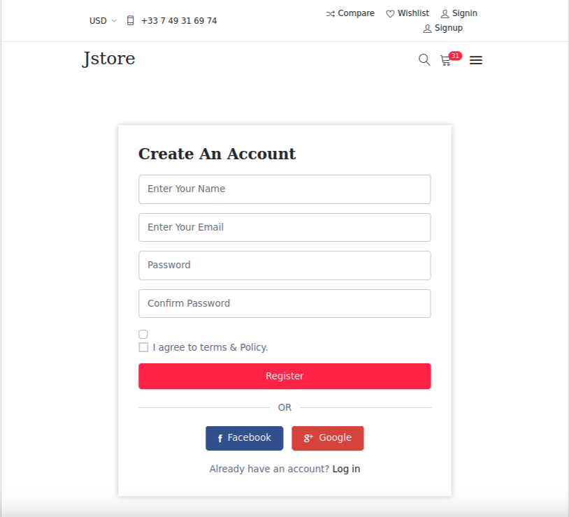
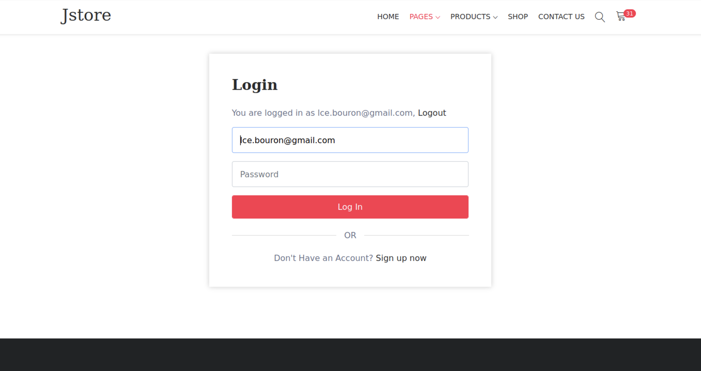

# Jstore e-commerce

## Objectifs

- Création d'un site e-commerce complet en Symfony avec backoffice et plusieurs moyens de paiement (Carte CB, paypal ...)

### Mise en place de l'interface utilisateur 

##  Création du service et de la page d'inscription 

##  Création du formulaire de connexion d'un utilisateur et la page de profil 

##  Création du back office avec EasyAdmin 

Stack utilisée :
* Symfony 7
* SQLite 3

